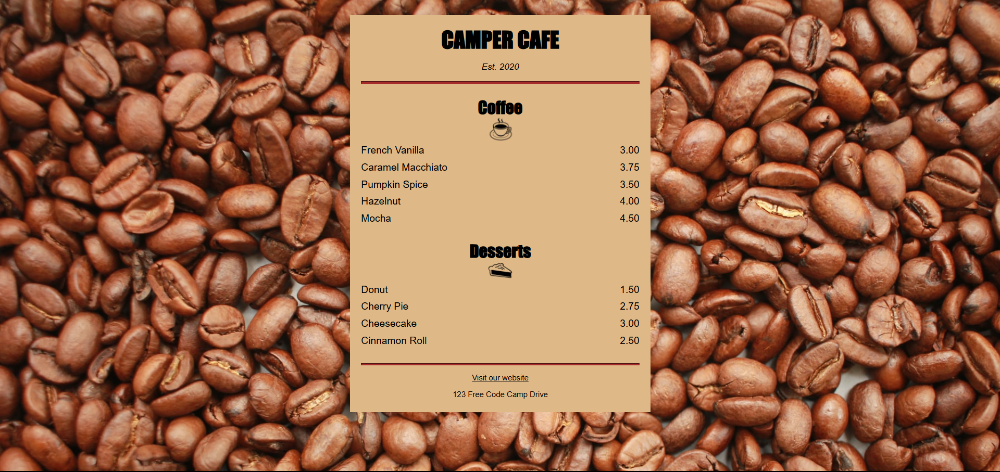

# ☕ CafeMenu

Welcome to the **CaféMenu** repository! This project consists of a simple cafe menu website, developed with **HTML5** and **CSS3**. The goal is to present a clean and responsive layout that can be used by cafes or restaurants to display their products in an attractive way.

## Layout

  

## 📋 Features

- **Responsive Layout:** Adapts to different screen sizes, providing a good experience on mobile devices and desktops. 

- **Pleasant Design:** Uses a soft color palette and readable typography to highlight menu items. 

- **Simple Structure:** Easy to understand and modify, ideal for beginners in web development.

## 🛠️ Technologies Used

- **HTML5**: Structuring the page content.
- **CSS3**: Styling and responsive layout.